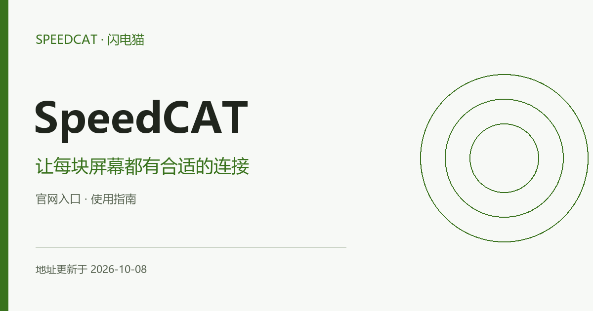

# SpeedCAT機場（SpeedCAT · 閃電貓）官網入口與使用指南 **（更新於2026-10-08）**

[简体中文](README.md) · **繁體中文** · [English](README.en.md) · [日本語](README.ja.md) · [한국어](README.ko.md) · [Русский](README.ru.md)

本專案由SpeedCAT官方釋出與維護。SpeedCAT 也常以閃電貓名稱出現。本頁圍繞單裝置、多裝置與持續觀影等使用安排，整理套餐對比和連線檢查方法。

**地址更新於 2026-10-08（北京時間）**

## SpeedCAT · 閃電貓 · SpeedCAT機場官方地址

| 入口 | 訪問地址 |
| --- | --- |
| 入口 1 | [shandianmaovpn.com](https://shandianmaovpn.com/) |
| 入口 2 | [shandianmaovpn.org](https://shandianmaovpn.org/) |

以上鍊接是網站入口，供訪問服務資訊與管理賬戶使用；它們不是個人訂閱連結，也不是代理節點。多個域名可能連線同一賬戶服務，不代表獨立備用線路或速度差異。

## 按裝置規模選擇接入方案

SpeedCAT 也常以閃電貓名稱出現。本頁圍繞單裝置、多裝置與持續觀影等使用安排，整理套餐對比和連線檢查方法。

### 1. 統計同時線上裝置

把手機、電腦和其他終端分開列出，比較同時連線規則，而不僅統計安裝過軟體的數量。

### 2. 同時看額度與上限

套餐比較時一起記錄流量、連線數、速率限制和付款週期，避免只按名稱判斷檔位。

### 3. 按實際內容測試

使用相同解析度和相近時段觀察播放緩衝，網路峰值與連續播放體驗要分開看。

## 使用體驗如何檢查

把地區、運營商、時段、客戶端版本和目標應用保持一致，再比較連線結果。持續訪問、下載峰值和應用地區識別是不同指標；失敗或超時也應記錄。本文未釋出本次實測速度或實時節點狀態。

可在自己的裝置上記錄以下資訊，向賬戶支援反饋時隱藏個人憑據：

| 記錄項 | 填寫方式 |
| --- | --- |
| 裝置與網路 | 系統、客戶端版本、運營商及 Wi-Fi／移動資料 |
| 當前配置 | 節點名稱、訂閱更新時間，不記錄金鑰 |
| 具體場景 | 應用名稱、操作步驟與觀察到的結果 |
| 發生時間 | 註明日期、時間及所在時區 |

## SpeedCAT常見問題

### 閃電貓與 SpeedCAT 如何辨認？

兩種名稱都用於該品牌。本頁地址中使用 shandianmao 拼寫，可儲存完整連結便於下次訪問。

### 增加裝置一定需要升級套餐嗎？

先核對當前套餐的同時線上規則；僅安裝客戶端不一定增加同時連線，但多個終端實際使用可能會。

### 當前套餐價格與活動在哪裡確認？

進入賬戶檢視當前訂單，核對實付金額、付款週期、流量重置、有效期、裝置限制與售後條件。歷史截圖和舊優惠碼不能代替當前交易條款。

## 使用本倉庫的入口網頁

`index.html` 提供SpeedCAT入口導航、完整域名、複製按鈕、操作指南和閱讀確認清單。可在本地開啟，也可將本目錄放在靜態 Web 伺服器上使用；頁面無需構建，不收集賬戶資訊，不自動跳轉。倉庫推送本身不會部署網站。

## 更新與反饋

地址或文件有誤，可在本倉庫提交 Issue，附上域名、發生時間與頁面提示。登入、訂單和付款問題請透過賬戶頁面的支援渠道處理。不要公開密碼、支付資訊或個人訂閱連結。更新日期隨地址清單的實際變更維護，不按訪問或構建自動重新整理。
